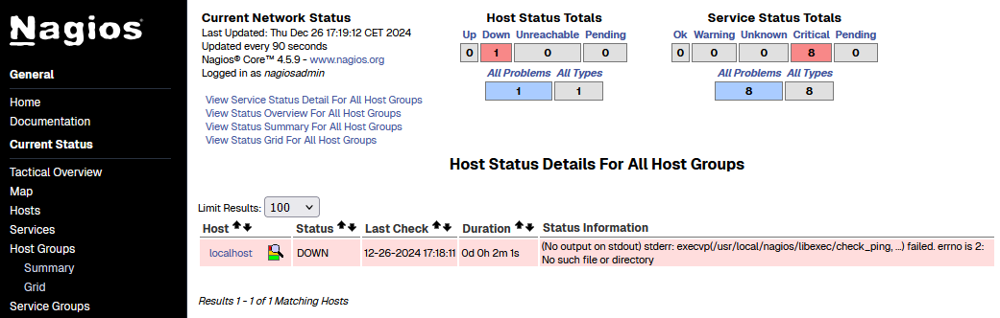
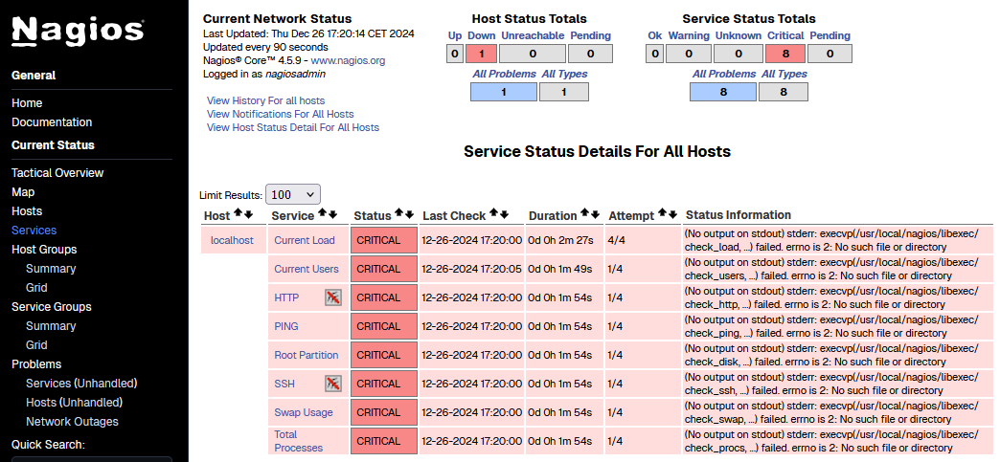
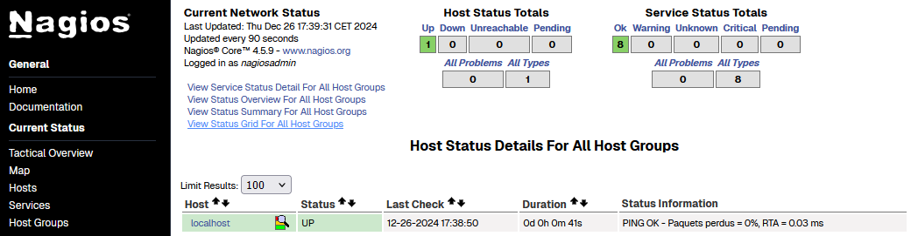
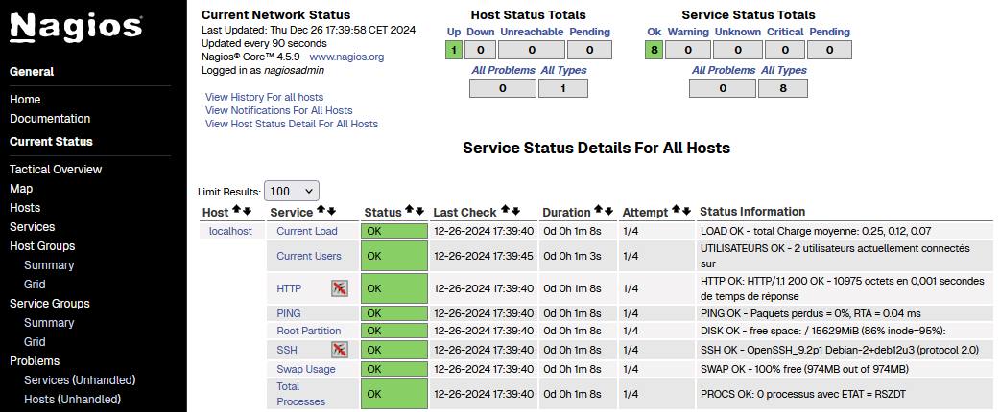

<link rel="stylesheet" type="text/css" href="../../assets/css/principal-theme.css">

###### 📂 Vous êtes ici : [Accueil](../../index.md) > [Nagios Core](../nagioscore-debian/index.md) > <a href="." style="color: #ff9900; text-decoration: underline;">Installer Nagios Core</a>

<div style="background-color: #333; color: #fff; border-left: 5px solid #ff9900; border-right: 5px solid #ff9900; padding: 18px 22px; margin-bottom: 18px; text-align: center;">
  <strong style="font-size: 22px; color: #ff9900;">📚 INSTALLATION DE NAGIOS CORE SUR DEBIAN</strong>
</div>

<div style="color: #d9534f; font-weight: bold; margin-bottom: 1em;">
  <p>Ce guide suppose les éléments suivants :</p>
  <ul>
    <li><strong>Distribution :</strong> Vous utilisez la distribution <strong>Debian</strong>.</li>
    <li><strong>Accès administrateur :</strong> Vous êtes connecté en tant que <code>root</code> (via la commande <code>su -</code>).</li>
  </ul>
  <p>Si ce n'est pas le cas, ajoutez <code>sudo</code> devant chaque commande pour l'exécuter avec les privilèges administratifs.</p>
</div>

<hr style="border: 1px solid #ccc; height: 1px; background-color: #ccc; border: none;">

<div style="background-color: #333; color: #fff; border-left: 5px solid #00bcd4; padding: 12px 12px; margin-bottom: 18px;">
  <strong style="font-size: 17px; color: #00bcd4;">🖥️ DEPUIS VOTRE SERVEUR NAGIOS :</strong>
</div>

### Pré-requis

**Mettez à jour votre système :**  
Avant chaque installation, il est important de s'assurer que le système est à jour.
```
apt update && apt upgrade
```

**Installez les paquets nécessaires :**  
Avant d'installer Nagios, il est essentiel d'installer les paquets nécessaires au bon fonctionnement de Nagios et à son environnement.
```
apt install unzip autoconf gcc libc6 make wget apache2 apache2-utils php libgd-dev openssl libssl-dev
```

---

### Téléchargement Nagios Core

**Placez-vous dans un répertoire temporaire :**
```
cd /tmp
```

**Téléchargez Nagios :**  
Dans l'exemple ci-dessus, nous installons la version la plus récente au moment où nous rédigeons cette documentation. Si vous voulez connaitre la dernière version, rendez-vous sur [Nagios Core Downloads](https://www.nagios.org/downloads/nagios-core/).
```
wget https://assets.nagios.com/downloads/nagioscore/releases/nagios-4.5.9.tar.gz
```

**Extraire le dossier téléchargé :**
```
tar -xzvf nagios-4.5.9.tar.gz
```

---

### Configuration et installation de Nagios

**Placez-vous dans le répertoire extrait :**
```
cd nagios-4.5.9
```

**Exécutez le script de configuration :**
```
./configure --with-httpd-conf=/etc/apache2/sites-enabled
```

**Compilez les fichiers :**
```
make all
```

**Créez le groupe et l'utilisateur Nagios sur le système :**
```
make install-groups-users
```

**Installez les fichiers de configuration et démarrez Nagios :**
```
make install
make install-daemoninit
make install-commandmode
make install-config
make install-webconf
```

**Activez les modules nécessaires pour Apache :**
```
a2enmod rewrite
a2enmod cgi
```

**Créez un compte administrateur :**
```
htpasswd -c /usr/local/nagios/etc/htpasswd.users nagiosadmin
```

**Redémarrez les services :**
```
systemctl restart apache2
systemctl restart nagios
```

**Accédez à l'interface Nagios :**
```
http://[adresse_IP]/nagios
```

---

### ETAT ACTUEL

  



⚠️ Origine du problème : Nous avons installé et configuré Nagios, mais rien n'a été fait au sujet des plugins.

---

<div style="background-color: #333; color: #fff; border-left: 5px solid #ff9900; border-right: 5px solid #ff9900; padding: 18px 22px; margin-bottom: 18px; text-align: center;">
  <strong style="font-size: 22px; color: #ff9900;">📚 INSTALLATION DES PLUGINS EN LOCAL</strong>
</div>

Pour superviser une machine, Nagios utilise des plugins, des scripts exécutés automatiquement à intervalles réguliers pour surveiller l'état des services. Il est donc nécessaire d'installer ces plugins localement, afin que Nagios puisse surveiller l'état de la machine sur laquelle il est installé (localement).

**Installez d’abord les paquets nécessaires :**  
```
apt install nagios-plugins
```

- L'installation des **plugins** est nécessaire, car ils contiennent les scripts exécutés localement qui fournissent les informations de supervision demandées.

**Vérification de l'etat :**


Pourquoi rien n'a changé ? Si vous lisez attentivement la colonne "Status Information", vous remarquerez que Nagios attends ces plugins à un endroit bien spécifique, or, la commande `apt install nagios-plugins` installe par défaut les plugins dans un autre répertoire.

**Déplacez les plugins dans le bon répertoire :**  
```
mv /usr/lib/nagios/plugins/* /usr/local/nagios/libexec/
```
```
chown -R nagios:nagios /usr/local/nagios/libexec
```
```
chmod -R 750 /usr/local/nagios/libexec
```

**Visualiser les onglets hosts/services :**

  

  

### **[↩️ Retour](../../linux/nagioscore-debian/index.md)**
