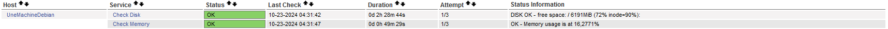

<link rel="stylesheet" type="text/css" href="../../../assets/css/principal-theme.css">

###### 📂 Vous êtes ici : [Accueil](../../../index.md) > [NagiosCore Debian](../../nagioscore-debian/index.md) > [Superviser avec NRPE](../supervision-nrpe.md) > <a href="." style="color: #ff9900; text-decoration: underline;">Superviser Système Linux</a>


# 📚 Superviser un sysème Linux (debian) avec le plugin NRPE

Bienvenue dans ce guide dédié à l'installation et à la configuration du plugin **NRPE** sur un système Debian. Vous allez apprendre comment mettre en place NRPE pour assurer la supervision de votre machine par le serveur Nagios.


---

<!-- Alerte importante concernant les droits d'utilisateur -->
<div style="color: #d9534f; font-weight: bold; margin-bottom: 1em;">
  ⚠️ <strong>Important :</strong>
  <ul>
    <li>Ce guide part du principe que vous êtes connecté en tant que <code>root</code> (via <code>su -</code>).</li>
    <li>Si ce n'est pas le cas, ajoutez <code>sudo</code> devant chaque commande.</li>
  </ul>
</div>

---

## Objectif

L'objectif de ce guide est de comprendre comment superviser efficacement vos machines et collecter des informations sur leur état. Pour établir un lien entre le serveur Nagios et un hôte cible, nous devons installer et configurer le plugin NRPE sur les deux machines.

<hr style="border: 1px solid #ccc; height: 1px; background-color: #ccc; border: none;">

## Installation et Configuration de NRPE

### 🖥️ Depuis un Système Linux (Debian)

Pour superviser un système Linux (Debian) avec le plugin NRPE, suivez les étapes ci-dessous. Cela vous permettra de configurer efficacement la machine afin qu'elle soit surveillée par votre serveur Nagios.

<hr style="border: 1px solid #ccc; height: 1px; background-color: #ccc; border: none;">

### Étapes à Suivre

**Mettre à jour le système :**  
Assurez-vous que votre système estf à jour pour éviter les problèmes de compatibilité.

```
apt update && apt upgrade
```

<hr style="border: 1px solid #ccc; height: 1px; background-color: #ccc; border: none;">

**Installer les paquets nécessaires :**  
Installez le serveur NRPE et les plugins Nagios.

```
apt install nagios-nrpe-server nagios-plugins
```

<hr style="border: 1px solid #ccc; height: 1px; background-color: #ccc; border: none;">

**Modifier le fichier de configuration NRPE :**  
Ouvrez le fichier de configuration NRPE pour autoriser les connexions depuis votre serveur Nagios.

```
vim /etc/nagios/nrpe.cfg
```

- **Configurer les adresses IP autorisées :**  
  Ajoutez l'adresse IP de votre serveur Nagios à la ligne suivante (par exemple, pour l'IP `192.168.13.2`):

  ```
  allowed_hosts=127.0.0.1,::1, 192.168.13.2
  ```

<hr style="border: 1px solid #ccc; height: 1px; background-color: #ccc; border: none;">

**Redémarrer le service NRPE :**  
Appliquez vos modifications en redémarrant le service NRPE.

```
systemctl restart nagios-nrpe-server.service
```

<hr style="border: 1px solid #ccc; height: 1px; background-color: #ccc; border: none;">

### 🖥️ Retournez sur Nagios pour définir des Hôtes

Après avoir configuré votre machine Debian pour NRPE, vous devez maintenant définir cet hôte sur votre serveur Nagios. Cela permettra à Nagios de commencer à surveiller la machine.

<div style="border: 1px solid #007BFF; border-radius: 5px; padding: 10px; margin: 1em 0;">
    <strong>📝 Méthodes de Configuration</strong>
    <p>Il existe deux approches pour gérer les fichiers de configuration des hôtes dans Nagios :</p>
    <ol>
        <li><strong>Un seul fichier .cfg :</strong> Regroupez toutes les machines dans un seul fichier. Cette méthode peut rendre la gestion plus complexe.</li>
        <li><strong>Fichiers séparés :</strong> Créez un fichier .cfg pour chaque machine. C'est la méthode recommandée car elle facilite la gestion et la maintenance.</li>
    </ol>
    <p>Dans ce guide, nous allons opter pour la méthode des <strong>fichiers séparés</strong>.</p>
</div>

<hr style="border: 1px solid #ccc; height: 1px; background-color: #ccc; border: none;">

#### Création du Fichier de Configuration pour l'Hôte (SrvDeb)

**Créer le fichier de configuration :**  
Accédez au répertoire approprié et créez le fichier pour votre machine (SrvDeb).

```
touch /usr/local/nagios/etc/servers/UneMachineDebian.cfg
```

<hr style="border: 1px solid #ccc; height: 1px; background-color: #ccc; border: none;">

**Éditer le fichier :**  
Ouvrez le fichier créé pour ajouter les informations nécessaires.

```
vim /usr/local/nagios/etc/servers/UneMachineDebian.cfg
```

- **Ajouter les définitions de l'hôte :**  
Insérez le code suivant dans le fichier :

   ```plaintext
   define host {
      use                     linux-server          ; Modèle déjà prédéfini pour les serveurs Linux
      host_name               UneMachineDebian      ; Nom de l'hôte (machine à superviser)
      alias                   Serveur de Mail       ; Alias (juste l'affichage dans Nagios)
      address                 192.168.1.201         ; Adresse IP de la machine
   }
   ```

<hr style="border: 1px solid #ccc; height: 1px; background-color: #ccc; border: none;">

#### Redémarrez le service nagios (sinon reboot) :

```
systemctl restart nagios
```

<hr style="border: 1px solid #ccc; height: 1px; background-color: #ccc; border: none;">

Cliquez sur l'onglet `host` à gauche, vous pouvez maintenant voir votre machine qui y est référencée, pour mon cas j'ai remonté une machine debian ayant pour nom `AP4-GLPI` :


---
---
---


# Définir des Services

## Ajouter un service directement (sans template, non recommandé) :
Du coup pour vérifier l'espace disque :
vérifier si la commande est dispo dans :

```
vim /usr/local/nagios/etc/objects/commands.cfg
```

Editez dans le fichier `.cfg` de la machine à qui vous voulez rajouter ce service :

```
/usr/local/nagios/etc/servers/UneMachineDebian.cfg
```

puis rajouter cette section : 

```
define service {
    host_name               UneMachineDebian            ; Nom de de l'hôte auquel ce service est associé
    service-description     Check local Disk            ; Description du service
    check_command           check_local_disk!20!10!/    ; La commande qui sera exécuter
    use                     generic-service             ; Utilise les valeurs de ce modèle si non défini
}
```
La méthode ci-dessus est déconseillée, car il faut à chaque fois définir la commande lorsque l'on crée un service... 
Cela peut devenir long et fatigant. Il est préférable de définir tous les services et dans ces services ajouter toutes les commandes dans le fichier de templates, puis d'utiliser ces templates lors de la création des services. Cela simplifie le processus et évite les répétitions inutiles.

## Ajouter service avec template (avec template, recommandé): 

Avant de créer un template de service (template destiné à fournir un service, en gros il va executer une commande pour remonter des informations), il est essentiel de déterminer quelle commande ce template va utiliser pour accomplir sa tâche. Vérifiez la commande appropriée que vous allez intégrer dans votre fichier de configuration :

```
vim /usr/local/nagios/etc/objects/commands.cfg
```


Une fois avoir relevé la commande, on peut aller créer le template de service en précisant la commande (qu'on a relevé dans **commands.cfg**).
```
vim /usr/local/nagios/etc/objects/templates.cfg
```
On ajoute tout en bas quelques templates de service, par exemple :
```
define service {
    name                    template_check_disk        ; Template pour la vérification du disque
    use                     generic-service            ; Utilisation du modèle générique
    check_command           check_local_disk!20!10!/   ; Commande pour vérifier le disque
    register                0                          ; Indique que c'est un template et non un service réel
}
```
Puis, maintenant on peut juste ecrire le nom de ces templates dans nos fichiers destinés à nos machines:
```
vim /usr/local/nagios/etc/servers/MaMachineDebian.cfg
```
Et on peut rajouter ces templates à ce fichier :
```
define service {
    use                     template_check_disk        ; Utilisation du template pour le disque
    host_name               UneMachineDebian           ; Nom de l'hôte
    service_description     Check Disk                  ; Description du service
}
```
Maintenant on va essayer de vérifier la mémoire, mais mauvaise nouvelle... Le plugin n'existe pas... mais bonne nouvelle, je l'ai créer pour vous !

Placez vous dans le répertoire où vous voulez qu'on installe le plugin, pour nous du coup :
```
cd /usr/local/nagios/libexec/
```
Installez le script depuis ma page github :
```
wget https://github.com/AGunalp/nagios-plugins/releases/download/nagioscore/check-memory.sh
```
Transferez le propriétaire ainsi que le groupe à nagios:
```
chown nagios:nagios /usr/local/nagios/libexec/check_memory
```
Donnez les droits d'executions :
```
chmod 755 /usr/local/nagios/libexec/check_memory
```
Maintenant qu'on a le plugin, il faut qu'on définisse la commande pour l'utilisation de ce plugin :
```
vim /usr/local/nagios/etc/objects/commands.cfg
```
et ajoutez tout en bas :
```
define command {
    command_name    check_memory
    command_line    $USER1$/check_memory.sh -w $ARG1$ -c $ARG2$
}
```
Maintenant qu'on l'a défini, on peut créer le template de service avec la commande qu'on a défini:
```
define service {
    name                    template_check_memory
    use                     generic-service
    check_command           check_local_memory!80!90
    register                0
}
```
Une fois le template créé, on peut l'utiliser dans tout nos fichiers d'hosts sans problème, nous on va le mettre dans MaMachineDebian.cfg
```
vim /usr/local/nagios/etc/servers/MaMachineDebian.cfg
```
```
define service {
    use                     template_check_memory
    host_name               UneMachineDebian
    service_description     Check Memory
}
```
Parfait, maintenant on attend et :




# A VENIR : 
<div style="border: 2px solid red; color: red; padding: 10px; background-color: #ffe6e6; border-radius: 5px; width: fit-content; margin: 10px 0;">
    ⚠️ <strong>Avis :</strong> La rédaction des commandes pour superviser les services arrive très bientôt. Merci de votre patience !
</div>

---

Les commandes pour superviser les services individuels sur vos hôtes seront ajoutées ici.

---

### **[↩️ Retour](../../nagioscore-debian/supervision-nrpe.md)**