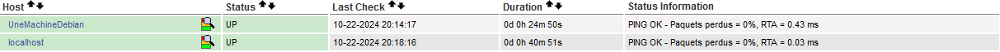

<link rel="stylesheet" type="text/css" href="../../../assets/css/principal-theme.css">

###### 📂 Vous êtes ici : [Accueil](../../../index.md) > [NagiosCore Debian](../../nagioscore-debian/index.md) > [Superviser avec NRPE](../supervision-nrpe.md) > <a href="." style="color: #ff9900; text-decoration: underline;">Superviser Système Linux</a>


# 📚 Superviser un sysème Linux (Debian) avec l'agent NRPE

<!-- Alerte importante concernant les droits d'utilisateur -->
<div style="color: #d9534f; font-weight: bold; margin-bottom: 1em;">
  ⚠️ <strong>Important :</strong>
  <ul>
    <li>Ce guide part du principe que vous êtes connecté en tant que <code>root</code> (via <code>su -</code>).</li>
    <li>Si ce n'est pas le cas, ajoutez <code>sudo</code> devant chaque commande.</li>
  </ul>
</div>

<hr style="border: 1px solid #ccc; height: 1px; background-color: #ccc; border: none;">

## Objectif

Maintenant que vous avez défini l'hôte dans Nagios, l’objectif de cette section est de vous montrer comment configurer et superviser les services de cet hôte.  
Vous allez apprendre à utiliser les templates pour réutiliser facilement des commandes et définir des seuils d’alerte, comme vérifier l’espace disque d'un système. 

<hr style="border: 1px solid #ccc; height: 1px; background-color: #ccc; border: none;">


# 🖥️ DEPUIS UNE MACHINE DEBIAN (A SUPERVISER) :

**Mettez à jour votre système :**  
Assurez-vous que votre système est à jour pour éviter les problèmes de compatibilité.

```
apt update && apt upgrade
```

<hr style="border: 1px solid #ccc; height: 1px; background-color: #ccc; border: none;">

**Installez les paquets nécessaires :**  


```
apt install nagios-nrpe-server
apt install nagios-plugins
```
- L'installation de **l'agent NRPE** est indispensable, car c'est cet agent, (présent notament sur notre serveur NAGIOS), qui permet l'échange des informations entre le serveur Nagios et les machines supervisées.
- L'installation de **plugins** est notamment nécessaire car ce sont des scripts exécutés localement sur chaque machine supervisée. L'agent NRPE transmet ensuite les résultats de ces scripts au serveur Nagios.

<hr style="border: 1px solid #ccc; height: 1px; background-color: #ccc; border: none;">

**Modifiez le fichier de configuration NRPE :**  
Une fois avoir installé l'agent, on va lui précisé l'adresse IP du serveur avec lequel il va communiquer, donc editez le fichier `nrpe.cfg` :  
```
vim /etc/nagios/nrpe.cfg
```

- **Configurer les adresses IP autorisées :**  
  A la fin de cette ligne, rajoutez l'adresse IP du serveur Nagios (pour mon cas 192.168.1.200) : 
  ```
  allowed_hosts=127.0.0.1,::1, 192.168.1.200
  ```

  Cela permettra à l'agent NRPE de cette machine, à communiquer avec l'agent NRPE ayant comme IP `192.168.1.200` (donc pouvoir communiquer avec notre serveur)

<hr style="border: 1px solid #ccc; height: 1px; background-color: #ccc; border: none;">

**Redémarrez le service NRPE :**  
```
systemctl restart nagios-nrpe-server.service
```

<hr style="border: 1px solid #ccc; height: 1px; background-color: #ccc; border: none;">

# 🖥️ RETOURNEZ SUR VOTRE SERVEUR NAGIOS :

Après avoir configuré l'agent NRPE sur la machine que vous souhaitez superviser (pour établir une communication avec le serveur Nagios), vous pouvez maintenant définir cette machine en tant qu'hôte sur votre serveur Nagios.

Cela permettra à Nagios de commencer à la référencer dans l'interface de surveillance.

<div style="border: 1px solid #007BFF; border-radius: 5px; padding: 10px; margin: 1em 0;">

<strong>💡 À SAVOIR :</strong>

<strong>Voici Notre Méthode de Configuration des Hôtes dans Nagios :</strong>   

- Un seul fichier de configuration **.cfg** pour chaque machine que qu'on souhaite superviser avec Nagios.
- Par exemple, pour **10 machines** à superviser, à la fin on doit avoir **10 fichiers .cfg** distincts.
- Cette méthode, appelée **fichiers séparés**, est celle que nous allons utiliser dans ce guide.
- On va commencer par superviser qu'une seule machine (donc on utilise qu'un seul fichier **.cfg**).
</div>

<hr style="border: 1px solid #ccc; height: 1px; background-color: #ccc; border: none;">

**Créez un fichier en .cfg destiné à la machine à superviser :**  

Nous allons créer un fichier de configuration pour la machine Debian que nous voulons surveiller, nommée `UneMachineDebian.cfg`

```
touch /usr/local/nagios/etc/servers/UneMachineDebian.cfg
```
C'est dans ce répertoire, `/usr/local/nagios/etc/servers/`, que nous allons regrouper tous nos fichiers **.cfg** pour chaque machine à superviser. (Nous avons activé sur la page précédente ce répertoire dans le fichier de configuration `/usr/local/nagios/etc/nagios.cfg`).

<hr style="border: 1px solid #ccc; height: 1px; background-color: #ccc; border: none;">

**Éditez le fichier :**  

```
vim /usr/local/nagios/etc/servers/UneMachineDebian.cfg
```
<hr style="border: 1px solid #ccc; height: 1px; background-color: #ccc; border: none;">

- **Définissez l'hôte (l'hôte = machine à superviser) :**  

Rajoutez ce code dans votre fichier **.cfg** (en ajusatant) afin de définir l'hôte : 

    define host {
        use                     linux-server          ; Template pré-défini
        host_name               UneMachineDebian      ; Nom de l'hôte
        alias                   Serveur de Mail       ; Alias (juste l'affichage dans Nagios)
        address                 192.168.1.201         ; Adresse IP de l'hôte
    }

  - **use :** Les valeurs de ce template seront utilisées si certaines valeurs ne sont pas précisée, vous pouvez trouver ce template (ainsi que les valeurs associées) dans `/usr/local/nagios/etc/objects/templates.cfg`
  - **host_name :** Le nom de la machine à qui est destiné ce fichier (le nom de la machine qu'on souhaite superviser)
  - **alias :** Le nom affiché sur l'interface nagios (pour qu'on reconnaisse directement la machine).
  - **address :** L'adresse IP de la machine à qui est destiné ce fichier.


<hr style="border: 1px solid #ccc; height: 1px; background-color: #ccc; border: none;">

#### Redémarrez les services nagios (ou reboot) :

```
systemctl restart nagios
systemctl restart nagios-nrpe-server.service
```

<hr style="border: 1px solid #ccc; height: 1px; background-color: #ccc; border: none;">

Cliquez sur l'onglet `Host` à gauche, vous devriez maintenant voir apparaître la machine que vous avez configurée. Dans mon exemple, la machine Debian est référencée sous le nom `UneMachineDebian` :



<hr style="border: 1px solid #ccc; height: 1px; background-color: #ccc; border: none;">

## Ajout d'un service :

Chaque machine que vous souhaitez superviser a un fichier .cfg sur le serveur Nagios. Dans ce même fichier, vous allez définir les services à surveiller.

Pour cela, il est essentiel que chaque commande soit définie dans le fichier /usr/local/nagios/etc/objects/commands.cfg. Cela garantit que toutes les commandes nécessaires pour la surveillance des services sont disponibles.
  
Pour que tout cela fonctionne, il est important que chaque commande soit définie dans le fichier /usr/local/nagios/etc/objects/commands.cfg.

<div style="border: 1px solid #007BFF; border-radius: 5px; padding: 10px; margin: 1em 0;">

<strong>💡 À SAVOIR :</strong>

Le fichier `commands.cfg` contient de nombreuses commandes pour exécuter divers plugins. Cependant, certains plugins peuvent ne pas avoir de commandes prédéfinies. Dans ce cas, vous devrez créer votre propre commande en veillant à spécifier le nombre correct d'arguments requis par le plugin. Pour cela, consultez le script du plugin pour vérifier les arguments attendus.

PS : Ce fichier existe uniquement sur le serveur Nagios car il a été installé avec Nagios. 


</div>

<hr style="border: 1px solid #ccc; height: 1px; background-color: #ccc; border: none;">

Bon, dans notre cas, nous allons définir un service qui vérifie l'espace disque d'une machine.

**Allez voir si le plugin (pour vérifier un disque) existe :**

```
ls -l /usr/local/nagios/libexec/
```

Il est important de noter que le script sera exécuté sur la machine que vous souhaitez superviser, c’est-à-dire notre machine Debian. Ainsi, vous devez vous assurer que ce fichier existe sur votre machine Debian.

Puisque nous avons téléchargé et déplacé ces plugins à la fois sur le serveur Nagios et sur notre machine Debian, vous devriez normalement les retrouver sur les deux. En général, si un plugin est présent sur le serveur Nagios, il sera également sur la machine Debian.

<hr style="border: 1px solid #ccc; height: 1px; background-color: #ccc; border: none;">

**Vérifiez si la commande pour executer ce script est déjà défini :**

```
less /usr/local/nagios/etc/objects/commands.cfg
```

Dans notre cas, la commande pour executer correctement ce script existe :
```
define command {

    command_name    check_local_disk
    command_line    $USER1$/check_disk -w $ARG1$ -c $ARG2$ -p $ARG3$
}
```
- check_local_disk : Est le nom de la commande qui sera utilisée dans le template pour identifier le service de vérification de l'espace disque.

- command_line : Est la commande qui exécute le script et précise les arguments nécessaires, tels que les seuils d'avertissement et critique ainsi que le point de montage à vérifier.


Maintenant que nous avons vérifié l'existence de la commande, nous pouvons définir un template pour superviser l'espace disque.

<hr style="border: 1px solid #ccc; height: 1px; background-color: #ccc; border: none;">


**Définissez un template :**  
Après avoir identifié la commande, nous allons créer un template en spécifiant la commande à utiliser ainsi que les arguments nécessaires à son fonctionnement.
```
vim /usr/local/nagios/etc/objects/templates.cfg
```
**Ajoutez un templace à ce fichier :**
```
define service {
    name                    template_check_disk        ; Template pour la vérification du disque
    use                     generic-service            ; Utilisation du modèle générique
    check_command           check_local_disk!20!10!/   ; Commande pour vérifier le disque
    register                0                          ; Indique que c'est un template et non un service réel
}
```
- template_check_disk : Le nom du template qu'on utilisera au moment où défini les services dans le fichier **.cfg**.
- use : Les valeurs de ce modèle seront utilisés si on en défini pas.
- check_command : La commande de commands.cfg, en spécifiant cette fois si les arguments d'entrée.
- register : Indique seulement que c'est un template et non un service 

<hr style="border: 1px solid #ccc; height: 1px; background-color: #ccc; border: none;">

**Définissez un service avec le template :**  
Maintenant qu'on a ajouté le template, on peut maintenant définir un service dans notre fichier UneMachineDebian.cfg juste en précisant le nom du template.
```
vim /usr/local/nagios/etc/servers/UneMachineDebian.cfg
```
On défini ce service en précisant quel template ce service utilisera :
```
define service {
    use                     template_check_disk        ; Utilisation du template pour le disque
    host_name               UneMachineDebian           ; Nom de l'hôte
    service_description     Check Disk                  ; Description du service
}
```
- use : Représente le template qu'on utilise
- host_name : Le nom de la machine
- service_description : Le nom du service

<div style="border: 1px solid #007BFF; border-radius: 5px; padding: 10px; margin: 1em 0;"> 

<strong>💡 À SAVOIR :</strong>

Les templates vous permettent de lier facilement des seuils spécifiques, comme 80 % pour un avertissement et 90 % pour un état critique, à des commandes déjà définies dans <code>commands.cfg.</code> 

<strong> Par exemple : </strong> 

 Si vous créez un template pour surveiller l'utilisation du disque, vous pouvez ensuite appliquer ce template à plusieurs services. Cela signifie que vous n'avez pas besoin de redéfinir les seuils pour chaque service, car ils seront automatiquement appliqués grâce au template.</div>

RESTART NAGIOS

# A VENIR : 
<div style="border: 2px solid red; color: red; padding: 10px; background-color: #ffe6e6; border-radius: 5px; width: fit-content; margin: 10px 0;">
    ⚠️ <strong>Avis :</strong> La rédaction des commandes pour superviser les services arrive très bientôt. Merci de votre patience !
</div>

---

### **[↩️ Retour](../../nagioscore-debian/supervision-nrpe.md)**